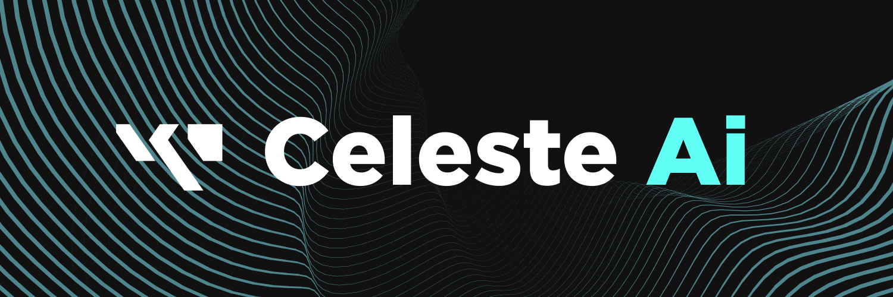

#

#
[>>> CONSIDER SUPPORTING OUR PROJECT!!](../informational/pages/support.md) 💖

# ⚠️ [DISCLAIMER] ⚠️
Amadeus software and or "Celeste-AI" is a closed source service, whilst this may or may not change in the future, reading these guides will currently not yield direct source code and will not give you any portion of our code, you are free to use the information I provide as a starting base for ideas and or making your own creations. You do not have permission to make a bot that is 1:1 a copy of our robots visuals and or assets, however you can make your own characters with our conceptual data in mind.

You are fully responsible for your actions and the actions of your creations, so make an effort to keep it in line, and we do not take any responsibility should you act in bad faith and or will not support malicious creators, nor do we take any responsibility of any damage that may or may not be done should you attempt to make something similar using our information, this includes but not limited to if you misbehave and get yourself banned off a platform, this is entirely your own issue.

If you are looking to meet some fun people, or perhaps you are wanting to ask questions about our service? Consider joining our [discord](https://discord.gg/RpqunvvNNF), we love making new friends. ❤️

# 🎓 [KEY-INFORMATION] 🎓
Standard functionality and ethics in regards to how a service like ours works, considered the bareline essentials for something like Celeste-AI.

* [[Ethics & Morality]](./pages/ethics.md) ⚠️ | **(Got some stuff thats important to talk about first...)**
* [[Baseline-Functionality]](./pages/baseline.md) | **(Let's get right into the absics on how I do my thing!)**

## 📄 [CONTENT] 📄
Features of our service that isn't considered "required" for functionality and growth, however they play a big role in improving the experiences of the average person who uses our service, and or add extra content to the base experience.

* [[Command-System]](./pages/commands.md) | **(On your order captain, I await your command!)**
* [[Emotional-System]](./pages/emotions.md) | **(Let's be amazing friends together, I'm so happy to talk to you!)**
* [[Celeste-Outfits]](./pages/outfits.md) | **(Like the fit? Trying my best!)**
* [[Event-System]](./pages/events.md) | **(Got some stuff to do!)**
* [[Action-System]](./pages/actions.md) | **(We're going to change it up a little!)**
* [[AMWalker]](./pages/traversal.md) **(You're too slow! Let's speed right through this! Gotta read this darn map first!)**

#

LEGACY INFORMATION ⚠️

 

⚠️ **Please note, these versions are fundamentally different than our current iteration, therefore some data may be very inaccurate compared to her current version, take caution when taking advice from them, these are only here for memories sake and may not reflect the current iteration of our service accurately anymore.**

- **[v1.0.0](./legacy/HowSheWorksV1.md)** | **(Woah this is really old!)**

- **[v2.0.0](./legacy/HowSheWorksV2.md)** | **(A little closer to home, but not quite.)**

---
---
---
**Copyright © 2022-2025 OPPEYSTORE. All rights reserved. The brand name 'OPPEYSTORE', its logos, and associated visual representations are protected by copyright. The underlying code powering Celeste-AI, including any proprietary AI models utilized, are owned by their respective creators, and their rights are acknowledged. No part of the OPPEYSTORE brand, including its name, logos, models, or code, may be reproduced, distributed, or transmitted in any form or by any means without the prior written permission of OPPEYSTORE.**