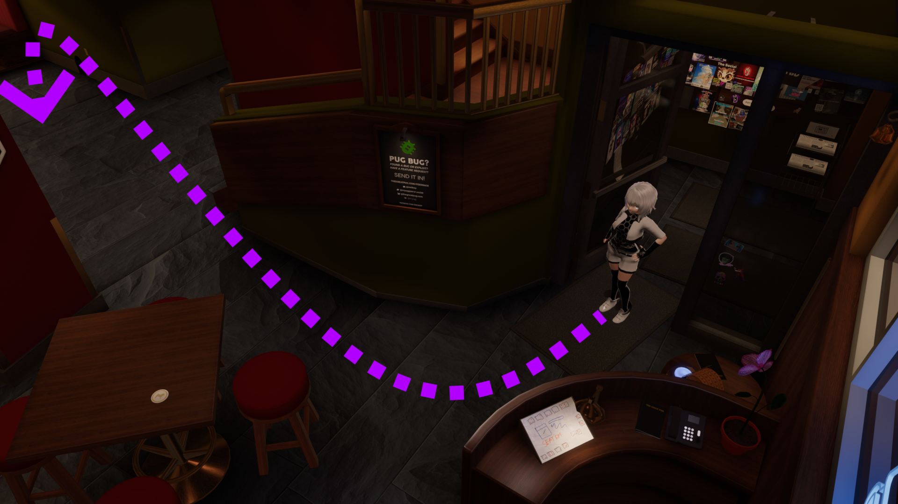

#

#
[>>> CONSIDER SUPPORTING OUR PROJECT!!](../../informational/pages/support.md) 💖

# [Action-System]

😘 How does this system currently work?

 

1.  **Actionary System Basics**:
This system allows celeste to run custom code under random conditions or extremely specific situations, be it for general-case or map-specific code, this is more useful for times when we want to **COMPLETELY** overwite celestes behavior under set conditionals, or by chance.

2.  **Forced Action**:
Only one action can be played at a time, unlike events from the [event-system](./events.md) which stack by priority, all other functionality will halt until the action is completed.

3.  **Early cancellation possible.**:
Under specific situations this system can have its effects cancelled early.

#

# [ALL GENERAL ACTIONS]
## [ActionStayIdle]

#
**[CONDITIONS]**:
* No other action selected.

⚠️ **This is the default "action" when nothing else is selected.**

⚠️ **Will never activate by default whilst engaging with a person.**

#
**[WHAT DOES THIS DO?]**:

Does nothing, stayin and chillin.

>**[RETURNS]**: **None**
#

## [ActionMoveToSpot]

#
**[CONDITIONS]**:
* Randomly selected whilst idling for a long period.

* Requires a valid graph to traverse the instance.

⚠️ **Disabled on maps that do not have a proper graph setup.**

⚠️ **Will never activate by default whilst engaging with a person.**

#
**[WHAT DOES THIS DO?]**:

Requests a **AMPath** from the [**AMWALKER system**](../pages/traversal.md) to a random pre-determined spot, then attempts to move to that spot.

>**[RETURNS]**: **None**
#

## [ActionMoveToFurthestSpot]

#
**[CONDITIONS]**:
* Randomly selected whilst idling for a long period.

* Requires a valid graph to traverse the instance.

⚠️ **Disabled on maps that do not have a proper graph setup.**

⚠️ **Will never activate by default whilst engaging with a person.**

#
**[WHAT DOES THIS DO?]**:

Requests a **AMPath** from the [**AMWALKER system**](../pages/traversal.md)  to which is furthest from her current location, then attempts to run to that spot.

>**[RETURNS]**: **None**
#

## [ActionMoveToClosestSpot]

#
**[CONDITIONS]**:
* Ran on spawn into a world.
* Requires a valid graph to traverse the instance.

⚠️ **Disabled on maps that do not have a proper graph setup.**

#
**[WHAT DOES THIS DO?]**:

Requests a **AMPath** from the [**AMWALKER system**](../pages/traversal.md)  that is closest to her current position, then walks to it.

>**[RETURNS]**: **None**

#

## [ActionRefreshGame]

#
**[CONDITIONS]**:
* Spawn into instance.
* Eight real life hours pass.

#
**[WHAT DOES THIS DO?]**:

Forces the game to restart and rejoin the current lobby, gives us a fresh gamelog, and various other cleanup.

>**[RETURNS]**: **None**

#

## [ActionSpeakLine]

#
**[CONDITIONS]**:
* Randomly selected whilst idling for a long period.

⚠️ **Will never activate by default whilst engaging with a person.**

#
**[WHAT DOES THIS DO?]**:

Celeste will randomly self inference herself whilst idle, she can continue the conversation with a player unless her memory resets.

>**[RETURNS]**: **None**

#

---
---
---
**Copyright © 2022-2025 OPPEYSTORE. All rights reserved. The brand name 'OPPEYSTORE', its logos, and associated visual representations are protected by copyright. The underlying code powering Celeste-AI, including any proprietary AI models utilized, are owned by their respective creators, and their rights are acknowledged. No part of the OPPEYSTORE brand, including its name, logos, models, or code, may be reproduced, distributed, or transmitted in any form or by any means without the prior written permission of OPPEYSTORE.**