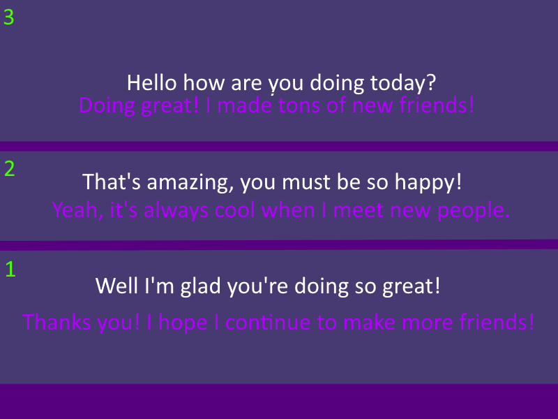
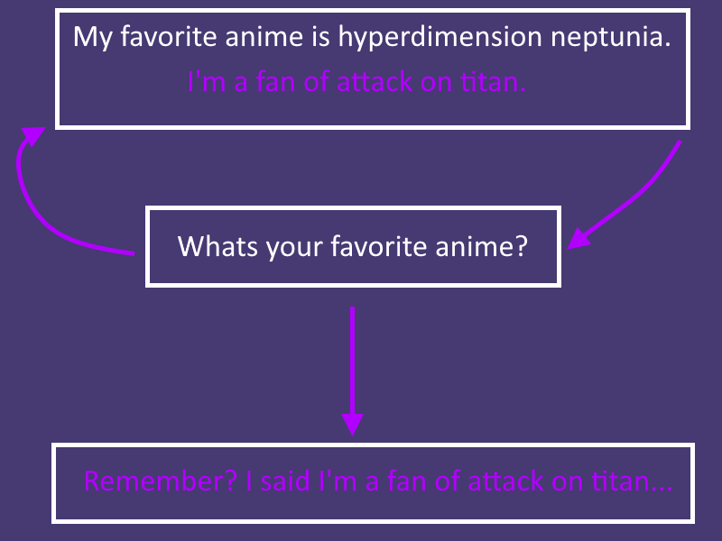

#

#
[>>> CONSIDER SUPPORTING OUR PROJECT!!](../../informational/pages/support.md) 💖

# [Baseline Functionality]

The information you're about to read is assuming that you're using python, however you can use pretty much any language.

The following passages also assume you know atleast the basics of python, you are expected to use this as a baseline for experimenting on your own and will not recieve any of our source code, also there are many ways you can do some of these methods some may even be better than how I handle it, please excercise trying new innovating things whilst getting a better grasp how these systems work.

I should also note that some details are intentionally left out from these passages either for security or things that we do that is currently closed source, some things may also be generalized down from what we actually do, we can't give away all our tricks! 😛

I personally use [miniconda](https://www.anaconda.com/docs/getting-started/miniconda/main) for my own python enviroments with the **3.10 version of python.**

Our service frontend is ran on windows however our backends are ran on linux, in order to make it easier we use [WSL2](https://learn.microsoft.com/en-us/windows/wsl/install) to be able to leverage linux-only optimizations, like [torch-compile](https://docs.pytorch.org/tutorials/intermediate/torch_compile_tutorial.html), its not neccessary but if you can get more speed your users will thank you.

⚠️ **These passages also mostly handle self-hosting on your local machine, you can substitute a lot of these systems with a third-party service should the costs be too much, as hardware can get extremely expensive... a example of this [is my current hardware](../faq#whats-your-current-current-hardware), you can get away with less but you'll also be slower should you do that, speaking of... consider [helping me out!](https://github.com/Celeste-AI/Celeste-AI/tree/main?tab=readme-ov-file#%EF%B8%8F-consider-helping-us-out-%EF%B8%8F) as this stuff is expensive, and I'd gladly appreciate any help even if you can only spread the word of my creation.**

#

🤔 How do we do basic communication with our users? [INFERENCE]

 

## 📽️ [RECORDING-REALTIME-DATA]
In order for our service to be able to understand our potential users we need to do a few things.
- record-audio (16000 HZ) **[REQUIRED]** [[recommended-for-recording]](https://pypi.org/project/PyAudio/)
- record-video **[OPTIONAL]**
- Virtual Audio Cable **[REQUIRED]** [[recommended-cable]](https://vb-audio.com/Cable/)

You want to route your VRChat audio to the virtual cable that way you can listen to it, also make sure to set your input and output device for your computer to use the virtual cable by default, that way vrchat uses that as the microphone by default.

#
Recording data is best done in a continous stream, this is so we can make sure we capture every bit possible from the audio, we may never fully know when someone is going to talk to us!

However you may quickly notice, that your data is starting to get very large and possibly slower, this is obviously very much not so ideal for our transcribers either.

To address this problem, we don't want to keep excess amount of silent data, best way to handle this is to prune data as it comes in past a set max unless a conditional is met.

This prevents overloading our systems, and makes your computer not catch on fire as much, and your transcriber will thank you.

However, another problem may arise should you be doing lots of pre-processing on audio or video data, you may notice that data is sometimes not perfectly being captured
all at once, even if it may be fast, thiiiis is normal~ probably.. either way I solve this by having the buffers being recorded side by side on seperate threads for each thing i'm recording, whilst giving another thread the job of processing data in chunks, this captures data flawlessly whilst also allowing for pre-processing like noise cancellation, [decibel calculations](https://www.electronics-notes.com/articles/basic_concepts/decibel/basics-tutorial-formula-equation.php), etc.

⚠️ **Please don't be a creep and retain your users voicedata, only use it for functionality and moderation.. its creepy and unneccessary to retain data in most other cases.**

Using decibel information you've hopefully calculated, you can predict if you should start recording fully and or when you should stop, and if you've done it correctly
you should have a pretty nice audio buffer that can be used later!

## 📝 [TRANSCRIBER Inference]
Now that you've gotten a proper audio signal you gotta transcribe it into text, this is required for inferencing the rest of the systems.

Usually [whisper](https://openai.com/index/whisper/) is one of the best currently to use for this task, there are other options but most use this.

Currently I personally use [whisperX](https://github.com/m-bain/whisperX).

Now, would you look at that as well, that **16000 HZ audio buffer** we created is just what we need for whisper to be able to properly transcribe! ❤️

There's tons of [models to choose from](https://huggingface.co/models?other=whisper), experiment!

⚠️ **I should note that quality will also be lower with less powerful models obviously, also these models can mess up when transcribing, this is unavoidable, so be aware suffering is part of the job, also If you want something a lil lower end you can try [Vosk](https://github.com/alphacep/vosk-api), but I don't recommend it as its reallllly old.**

## 💬 [LLM Inference]
As before we're gonna need [huggingface-transformers](https://github.com/huggingface/transformers)!

We're also going to need a model to try out... lets use a classic!
[MPT-7B](https://huggingface.co/mosaicml/mpt-7b-instruct)

Slap that text you got from the transcriber in and you should get a hopefully nice response!

⚠️ **Should note, there is way better models than MPT-7B nowadays, but its a good starting point, also if you noticed I recommended a instruct model, unless you can fully finetune a model yourself instruct models will work better than the base model in most cases, you can even do smaller finetunes on them for increased performance to what you want!**

I also recommend adding in some extra optimizations, like early stopping (why generate past what you need?) and stuff like [flash-attention](https://github.com/Dao-AILab/flash-attention) to try and squeeze a bit more performance, [you can also try quantizing your model down to 4bit](https://huggingface.co/blog/4bit-transformers-bitsandbytes), however that is lossy.

Finally, we give celeste a three strike system, if she 'fails' to generate a response three times she will give up trying to respond, 'failing' usually is if she breaks format too much, or if she says something that is considered "bad" or "malicious", unfortunately we can't stop every case automatically.. BUT we can reduce the amount of bad generations as much as possible without disrupting the user experience!

# 🗣️ [TTS Inference]

Originally, Celeste used **Microsoft Cortana** (also known as "Eva") for her voice. This was achieved by modifying registry files to enable access and use her voice as a Text-to-Speech (TTS) engine.

This method is no longer used, as we started to use, [**Coqui-TTS**](https://github.com/coqui-ai/TTS) for a while, which provided Celeste with her own unique and custom voice that was ran locally. Although Coqui is now associated with a defunct company, the TTS should still function.

Our latest TTS solution is more 'custom' however its currently private. It offers fantastic features like emotional range control, multilingual speech, incredible speed, and improved pronunciation for various words, we also took the time to update celestes dataset to be higher quality and crispier.

To ensure seamless speech, we pre-generate subsequent audio requests in the background as Celeste speaks. This basiiically eliminates speech delays in most scenarios.

#

🔎 Keeping track of the conversation [MEMORY]

 

# 🧠 [MEMORY-BUFFER]
In order to continue a conversation past our current question, we need to
keep track of the current conversation flow, we acutely call the "InfiniMemory" system.

The way we currently handle it is that we automatically 'forget' everything the moment a "session ends", a "session" being a timeframe that we will remember a current conversation unless forcibly reset.

This timeframe expands if we hear any noise, and while we're responding, effectively making it so we only reset our current memory buffer when we've been left idle for long periods of time or forced to reset early by external factors.

Basic memory is extremely simple, basically as we operate we get two things, a user question and the bots response, this is then combined into a "memory" and added to the "memory block", each "memory block" represents a different space of writable memory, this allows us to have multiple bots occupy the same system by requesting specific blocks, however I only allow X amount of recent memories to always be visible at a time in celestes view, theres a reason why.. because..

# 💡 [RECALL-SYSTEM]

We take this a step further, we call it the "recall system", which basically allows nearly well.. **infinite** memories.

This allows her to comment on things she has already said by 'recalling it', without having to have the whole memory buffer constantly displayed to her.

This GREATLY reduces tokens being used, and even makes the LLM MORE stable!

This is because less tokens == less context, when a memory is "recalled" we delete it from the history as its been brought forward as a "recollection" in the prompt.

In order to determine which memories we need we do a semi-custom implementation of [cosine similarity](https://www.sciencedirect.com/topics/computer-science/cosine-similarity#:~:text=Cosine%20similarity%20is%20a%20measure,of%20the%20angle%20between%20them.), we look inside the buffer for similarities to our current input, by combining both the answer and response of each memory, and if we find a similar enough memory we remember it, which affects the final answer.

#

🌎 Making many new friends! [NETWORKING]

 

In order for celeste to make new friends, she needs to access the [VRChat-Api](https://wiki.vrchat.com/wiki/VRChat_API)

Our service uses [vrchatapi-python](https://github.com/vrchatapi/vrchatapi-python) for interacting with the VRChat Api.

Whilst we are idle, we wait for requests to our bot to come in from vrchats notifications, if we detect one then we start processing them all in bulk.

⚠️ **We intentionally limit things like accepting friend requests up to 10 per minute, this is to prevent being ratelimited.**

We also run a few conditional checks to make sure an account is a valid "friend", due to the fact people may try to abuse this functionality, if all is green then we also send each new friend a one time invite to our group, exact specifics for being considered valid won't be mentioned as that would defeat the purpose of our security checks.

---
---
---
**Copyright © 2022-2025 OPPEYSTORE. All rights reserved. The brand name 'OPPEYSTORE', its logos, and associated visual representations are protected by copyright. The underlying code powering Celeste-AI, including any proprietary AI models utilized, are owned by their respective creators, and their rights are acknowledged. No part of the OPPEYSTORE brand, including its name, logos, models, or code, may be reproduced, distributed, or transmitted in any form or by any means without the prior written permission of OPPEYSTORE.**

