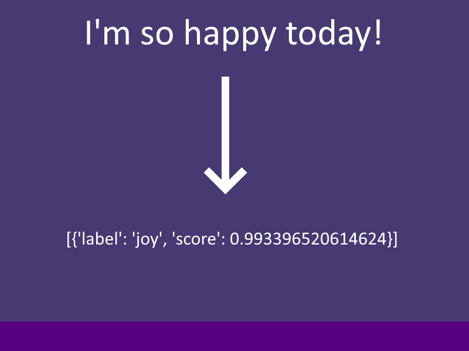

#

#
[>>> CONSIDER SUPPORTING OUR PROJECT!!](../../informational/pages/support.md) 💖

# [Emotional-System]

😘 How does this system currently work?

 
Currently we have a very simple implementation for emotions, we may expand this in the future.
When celeste makes a response she seperates her text into multiple chunks and then runs it through a emotion detection model, this gives us a output like this.

# 

When a result is created, as you see it gives us the most likely emotion we also see the score which is a scale from [0-1] which informs us how likely it is to be this emotion, for celestes sake we check if its above > 0.6 and if so, it returns the current detected emotion, elsewise celeste defaults to the "neutral" emotion for that chat turn, this continues till all emotions are decided for each turn.

This is then further fed into our other systems to utilize.

Emotional responses are also cross compatible, so she can be happy ---> sad etc.

Each emotion will have up to [3] custom animations alongside it.

⚠️ **In the future we plan to expand this system with way more animations, currently all hand animations default to the 'neutral' animation set.**

If we have more than [3] chat turns in a singular response, celeste will default to keep using the last animation in the set for any remainder turns.

#

# [CURRENT EMOTIONAL STATES]
## 😑 NEUTRAL

**[ANIMATION-SET]**

## 😃 JOY

## 😭 SADNESS

## 🤬 ANGER

## 🫢 SURPRISE

## 😨 FEAR

## 🥰 LOVE

---
---
---
**Copyright © 2022-2025 OPPEYSTORE. All rights reserved. The brand name 'OPPEYSTORE', its logos, and associated visual representations are protected by copyright. The underlying code powering Celeste-AI, including any proprietary AI models utilized, are owned by their respective creators, and their rights are acknowledged. No part of the OPPEYSTORE brand, including its name, logos, models, or code, may be reproduced, distributed, or transmitted in any form or by any means without the prior written permission of OPPEYSTORE.**

