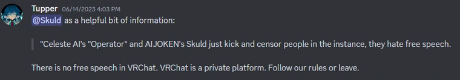

#

#
[>>> CONSIDER SUPPORTING OUR PROJECT!!](../../informational/pages/support.md) 💖

# 🕊️ [Ethics & Morality] 🕊️

This is not a surefire way for anything, however this is my own personal notes on how to keep things nice and clean, there are still a lot of things I personally struggle with, but if you can gain anything from this, be my guest.

#

### 🛡️ [Protecting Your Project (and yourself)]

Before you start creating a service similar to ours you should keep in mind some things.

* **Platform Compliance is Paramount**: Not all platforms will allow or endorse your creations. In some cases, they may even ban your creation and potentially you, depending on whether it violates their individual Terms of Service (TOS) or Community Guidelines. Never do anything that violates platform rules!

* **Understand the "Gray Area"**: Software like Celeste-AI often falls into a gray area for platforms like VRChat. It might not be explicitly against their (TOS), but it's also not directly encouraged. Companies can change this at any time and have the final say. Try to contribute positively to the community so they see your project as a fun, community-driven initiative rather than a threat.

* **Be Responsible with Code Releases**: While open-sourcing is great, and I personally enjoy releasing things to certain people at times, be mindful. Sometimes, it's really best to weigh the benefits against the worst-case scenarios. For example, there are some features on our service that, while cool, could greatly cause issues if released to the public en masse. We're actively trying to avoid mass botnets with these things.

* **Accept Platform Authority**: You are at the complete mercy of the platform you choose to operate on they get the final say. If you don't like it, then don't create your own bot, sadly commuication is very poor in general when it comes to places like VRChat in my experience, so its hard to really communicate concerns and or know whats okay and whats not, so for now its more of a guessing game at times as well, hopefully that will change in the future, but I doubt it.

If you wish to learn more about specifics for platforms like VRChat.

Stay informed with their [(TOS)](https://hello.vrchat.com/legal) and [Community Guidelines](https://hello.vrchat.com/community-guidelines).

Take it from [Tupper](https://vrchat.com/home/user/usr_c1644b5b-3ca4-45b4-97c6-a2a0de70d469) himself when it comes to VRChat.
#

#

### 💖 [Increasing the likeability of your creations and you]
* **Be Honest About Features**: Do not lie about your creation's abilities to try and profit. Be upfront and honest whenever possible. Joking is fine, but don't make a selling point a fake feature without at least informing your users or making it painfully obvious.

* **Empathize with Concerns**: You can't please everyone. Due to the nature of "AIBROS" and various other people misusing this technology negatively, there's a great disdain towards software involving ML, even if you don't partake in malicious acts.

    * Try to be reasonable and understanding of people's fears.
Provide clear opt-out options without pressuring users.

* **Practice Humility**: You are **NOT** above anyone else just because you've made a unique creation. This should go without saying, but there have been cases of this in the past, leading only to self-destruction. You are a normal human who has done something cool; keep it that way and stay grounded.

* **Avoid Aggressive Software Design**: Do not be overly aggressive with your software. Try to implement passive things to increase engagement. The last thing people want is a service that is more annoying than fun. (ex: avoid excessive pestering, prioritize user-initiated interactions).

* **Be Social:** Try not to sit there all the time glued to your creation being a anti-social person. As long as it's stable, it should be able to handle itself. Only occasionally check in and maintain moderation. Engage with your community and other users.
#
### 🤔 [Going into more detail into why so many people "hate ai"]

It's a bit of a weird and confusing topic, but from what I've personally seen it seems to mostly stem from "AIBRO-like people" who tend to try and "flex" on other individuals with ML tech like how someone might call themself an "artist" when they have a machine mash together stuff. 

**You are not an actual artist and with that attitude never will be if you rely on completely on ML models**

This tech isn't bad by itself, but when used incorrectly its the equivalent of misusing a weapon, you just don't do it and if you do, its not the weapon, its the user, if you're going around waving your fancy smancy "ML-Art" around and badmouthing actual artists you deserve to be absolutely ridiculed and made fun of, you're a part of the problem, same goes for anything else ML models can be used as a tool for, keep it as a tool nothing more nothing less.

* 🤓 There is some exceptions in my personal opinion, like if your model is somehow trained completely on your own art, I'd consider that a unique and inventive thing, you're not stealing either at that point.

Regardless, be kind and don't be a tool!
#
### 😔 Unfortunately a few bad apples ruin the bunch.

You will most likely face lots of criticism for what other people do, even if you particularly have no say in other peoples work, the best thing you can do is try to not let it get to you and explain to them that you aren't the same as these annoying people.

Remember, most people don't even understand how these things work let alone that there is differences between ML models, so keep that in mind when you see people mad, they're right to be mad, but just not at you.

So try to reach a mutual understanding and give them a good positive outlook on this stuff. Who knows, you may help someone realize their anger with you is unfounded, and if not thats okay too as long as they don't escalate into harassment, if that happens unfortunately there is not much you can do for them.

---
---
---
**Copyright © 2022-2025 OPPEYSTORE. All rights reserved. The brand name 'OPPEYSTORE', its logos, and associated visual representations are protected by copyright. The underlying code powering Celeste-AI, including any proprietary AI models utilized, are owned by their respective creators, and their rights are acknowledged. No part of the OPPEYSTORE brand, including its name, logos, models, or code, may be reproduced, distributed, or transmitted in any form or by any means without the prior written permission of OPPEYSTORE.**