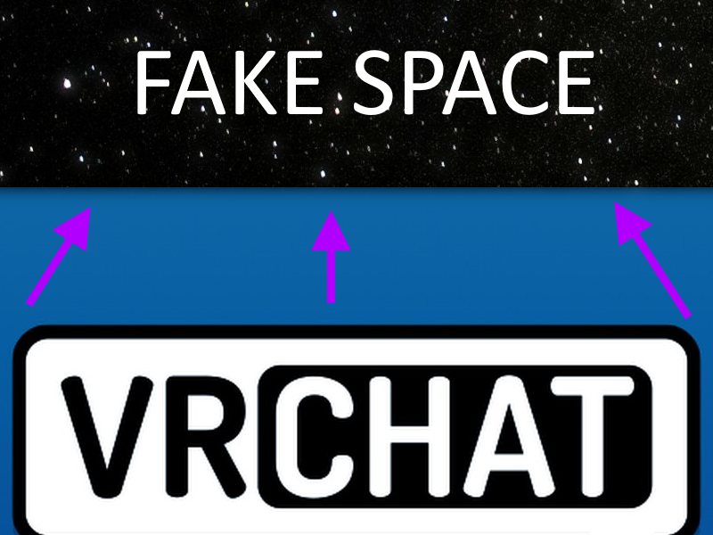
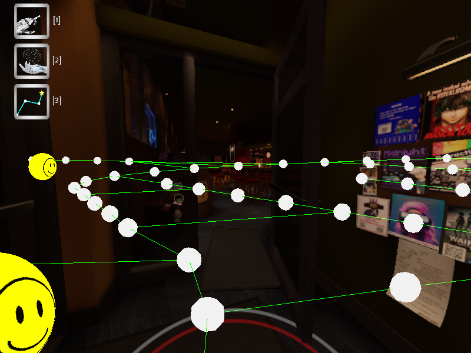
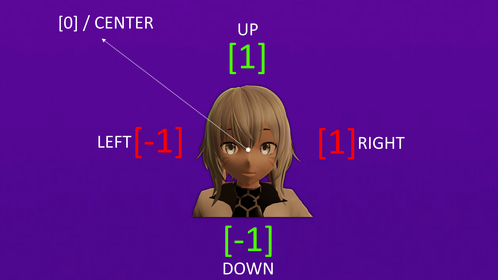

#

#
[>>> CONSIDER SUPPORTING OUR PROJECT!!](../../informational/pages/support.md) 💖

# [Amadeus-Walker System Overview]

Despite concerns about the extreme potential for abuse by bad actors, I've chosen to share the basic principles of this system. My decision was influenced by the observation that numerous developers big and small were attempting to replicate it and trying to "beat us", with varying levels of success. Therefore, I believe it's more beneficial to publicize the underlying concepts, however some more specific information is intentionally left out, someone who knows what they're doing should be able to fill in the gaps, it's not super hard once you solve the initial problems, you just have to adjust it to be used in platforms like VRChat.

* ⚠️ **first test of a preset path success [10/25/2024]**

* ⚠️ **first public preview of pathfinding was [11/3/2024]**

This system was particularly painful to implement, however through sheer determination, lots of research, and a little bit of help from some people, we created possibly the most if not the best pathfinding solution on VRChat to date that isn't violating any rules, we plan to further expand it and make more adjustments as time goes on to be even better and support way more interesting concepts.

# Establishing Core Data

One of the slightly more complex systems is the AMWalker system. It acts as a translation layer between VRChat and our local software, allowing for extremely precise and semi-custom implementation of [A*](https://www.youtube.com/watch?v=CgW0HPHqFE8), which, while it doesn't always guarantee the fastest possible route, usually it provides one of the fastest and can generate routes insanely quick.

However, the information required to perform these calculations (such as precise position and rotation) is not currently available by default on VRChat, meaning normally this isn't easy or even possible to calculate.

A common thought might be to modify the game directly; however, this approach violates VRChat's Terms of Service and is not a viable solution.

So how do we do it? Simple!

**We find a legitimate way to obtain that information!**

While we are not currently sharing our specific method, an alternative involves using screen shaders to encode positional and rotational data, which can then be reconstructed by an external script.

**⚠️ Be warned that using shaders to obtain this information can be interruptible if elements with higher render priority (ex: player nametags) obstruct the view.**

# Translation Layer

In order to traverse a map, we need to understand everywhere we can go. Since this information is not normally available to us, nor can we calculate this information in VRChat without breaking some rules, we needed to find a alternative solution.

#

# 
We create a purely hypothetical "fake space" layer, mirroring Unity's coordinate system, overlaid conceptually onto VRChat. As this space exists entirely on our end, it enables us to perform complex calculations previously impossible, unlocking new things that were simply not possible before.

This "fake space" loads a "graph" by using the world_id of the current world we are in that can be saved, reloaded, and edited locally, this allows us to design these graphs locally either by hand or automatically, whilst also allowing custom logic that can be applied when in specific maps.
#

#

⚠️ **Normally the graph is not visible however with our editor we can easilly edit and view it.**

With the rotation and positional data received prior, we are able to "sync" the "real world" with the "fake world".

This allows us to keep track of Celeste-AI's current location and keep it updated in real time with extreme accuracy, which is extremely vital for many other calculations.

# Pathfinding

As mentioned we currently implement a semi custom implementation of [A*](https://www.youtube.com/watch?v=CgW0HPHqFE8).

⚠️ **[This video may be able to help you understand how A* works in general.](https://www.youtube.com/watch?v=i0x5fj4PqP4)**

However A* isn't the only way to do this, just it seems to be the most practical in most cases for VRChat bots as of writing this. **(If this ever changes call me :>)**

⚠️ **[Dijkstra is another possible algorithm you can use, but tends to be way more slower and inefficient.](https://www.youtube.com/watch?v=9REexHx0hDY)**

For these kinds of creations, you want your path generation to be as fast as possible and using anything else whilst not disallowed, is highly discourged and bad practice for this usecase, you're basically nerfing your creation, whilst A* is not always guranteed to be the absolute fastest, its kind of a perfect balance between speed and power, and in most cases it is the fastest.

Now with our chosen algorithm (hopefully A*) you now can now move around the ma-- wait a minute.. how do we actually traverse a path?!

There are two potential routes you can take here.
* [OSC](https://docs.vrchat.com/docs/osc-overview) or [Controller Emulation.](https://pypi.org/project/vgamepad/)

For Celeste-AI, we do Controller Emulation, which gives us a bit more flexibility in what we can do.

First, we obtain a directional vector for each target node. This is calculated by comparing Celeste-AI's current position and rotation against the node's position, yielding a precise direction.

Using that direction, we then check the distances for X and Y (the Z-axis, is disregarded)

By checking the distances we obtain values from [-1 | 1] on the X and Y axis, essentially an attack vector, these values represent how far away our head is rotated from the selected target, we also cap it so it can never go lower than -1 or above 1.

#

#
Now that we have an attack vector, its head movement velocity is dynamically adjusted based on these two scales, slowing down as it approaches the target direction which is the closer it is to zero.

This results in extremely smooth head rotation when traversing and also while looking towards coordinates in general.

Using all this data, we now have enough to start having our creation move. We send a signal to our emulated controller to start rotating the head, and when the head is close to the center position, Celeste-AI begins moving forward, with its speed modulated based on the remaining distances.

This creates the effect of Celeste-AI 'stopping' while turning, whilst it also enhances both stability and visual smoothness.

#

---
---
---
**Copyright © 2022-2025 OPPEYSTORE. All rights reserved. The brand name 'OPPEYSTORE', its logos, and associated visual representations are protected by copyright. The underlying code powering Celeste-AI, including any proprietary AI models utilized, are owned by their respective creators, and their rights are acknowledged. No part of the OPPEYSTORE brand, including its name, logos, models, or code, may be reproduced, distributed, or transmitted in any form or by any means without the prior written permission of OPPEYSTORE.**